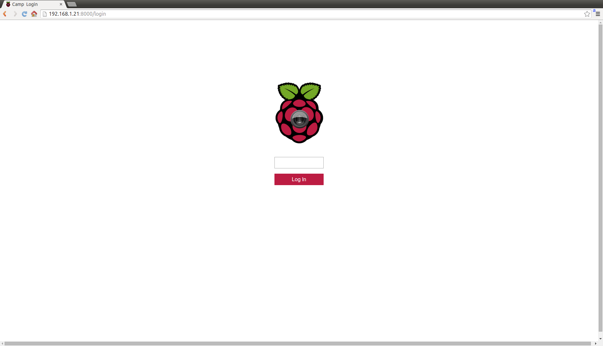

RaspiSSD
====

Object detection for your Pi

What it does
============

Hosts a website and applies a SSD MobileNet to the pi camera images in real time with approximately 1 FPS on a raspberry pi 3.


Installation
============

The project is a forke from Camp by Patrick Fuller.
Camp uses [tornado](http://www.tornadoweb.org/en/stable/) to create a
web server. It can interact with the [Pi camera](http://www.adafruit.com/products/1367)
with the aptly named [picamera](http://picamera.readthedocs.org/en/release-1.7/)
module. The
command below installs both sets of dependencies.

```
sudo apt-get install python3-pip libatlas-base-dev libjpeg-dev libopenjp2-7-dev libtiff5-dev fonts-freefont-ttf
sudo pip3 install tensorflow tornado picamera pillow
```

Once the dependencies are installed on your pi, you can clone this repository and
run the server.

```
git clone https://github.com/cwefelscheid/RaspiSSD.git
cd RaspiSSD
python3 server_tf.py
```
It can take up to 60 seconds for Tensorflow to initialize everything.

Navigate to http://your.r.pi.ip:8000 and check out your webcam.

####Password



With the `--require-login` flag, camp will open a login page before allowing
webcam access.

The default password is "raspberry". In order to change it, run this in your
camp directory:

```
python -c "import hashlib; import getpass; print(hashlib.sha512(getpass.getpass())).hexdigest()" > password.txt
```

This will prompt you for a password, encrypt it, and save the result in
`password.txt`.

Note that this level of password protection is basic - it's fine for keeping the
occasional stranger out, but won't stand up to targeted hacking.

####Run on startup

It's nice to have your pi start camp whenever it turns on. Let's make that
happen. Type `sudo nano /etc/rc.local` to open this file for editing, and add
the line `nohup python /home/pi/RaspiSSD/server_tf.py &` before the last line. Note
that you may need to change the path (`/home/pi/RaspiSSD/server_tf.py`) to point to
the right file.

####Customization

The website consists of `index.html`, `login.html`, and `style.css`. These can be
edited to change the look of camp.

If you want to add in extra functionality, edit `client.js` and `server_tf.py`.
The client should send a request to the server, which will then cause the
server to do something.

If you want to add in extra camera features, opencv comes with a lot of useful
computer vision algorithms. Check out its functionality before writing your
own.
